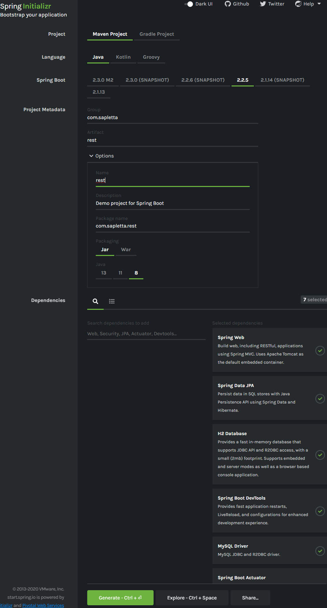

# java-task
+ Java 8+
+ Spring boot
+ docker
+ JPA
+ REST
+ UnitTest

### Data layer for DB entity, 

 can be very simple one with just few fields, for example:  

+ firstName 
+ lastName 
+ birthday 
+ country
+ isEmployed
 

### REST endpoints to make CRUD operation with entity from (1). 

### App should be runnable using docker. 

### Implement test for WS layer. 
 

# Spring init, maven pom.xml, ...

https://start.spring.io/

